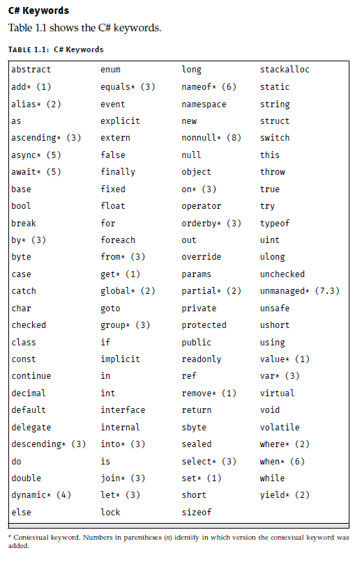

# How C# Works

In C# it is possible to have two classes in one file, and even a single class span multiple files with a feature called a partial class.

In a C# project typically a configuration file called a project file is included as part of the generated source code of your C# project. At a minimum it generally identifies what files to include in the compilation, what application type rto build, which .NET framework to support, and which potential settings are needed to debug or launch the application, along with other dependencies the code may rely on ( libraries ).
All `*.cs` files in the same directory or subdirectories are included in the compile.

# Syntax Fundamentals

## Keywords

The compiler uses the keywords to identify the structyre and organization of the code.

after C# 1.0, no new **reserved keywords** were introduced to C#. however, some constructs in later versions use **contextual keywords** which are significant only in specific locations. Outside these designated locations, contextual keywords have no special significance.

## Identifiers

The identifiers assigned to a construct are used to refer to the construct later, so it is important that the names the dec assigns are meaningful.

- The Framework Design Guidelines advise against the use of abbreviations or contractions in identifier names.
- Favor clarity over brevity when naming identifiers.
- Do not use any acronyms unless they are widely accepted, and even then use them consistently
- Do not encode the type of the variable in its identifier.

Keywords may be used as identifiers if they include `@` as a prefix. like: `@return`,`@throw()`

There are four undocumented reserved keywords in the Microsoft implementation: `__arglist, __makeref, __reftype, __refvalue`
The designers of C# reserve the right to make any identifier that begins with two underscores into a keyword in a future version. Its best to avoid making such an identifier.

## Type Definition

All executable code in C# appears within a type definition, and the most common type definition begins with the keyword `class`.
A class definition is the section of code that generally begins with `class identifier { ... }`.
The name used for the type by convention is PascalCase.
Name classes with nouns or noun phrases.

## Main

The location where C# programs begin execution is the `Main` method.
When we execute the program by running `dotnet run`, the program starts up, resolves the location of `Main` and begins executing the first statement.

*`Main` should always be static and always have the name Main.*

C# requires that the `Main` method return either `void` or `int` and that it take either no parameters or a single array of strings.
The `args` parameter is an array of strings corresponding to the command line arguments. The executable name is not included in the `args` array (unlike C/C++). To retrieve the full command used to execute the program, including the program name, use `System.Environment.CommandLine`.

The `int` returned from `Main` is the status code, and it indicated the success of the program execution. A return of a nonzero value generally indicates an error.
C# 7.1 also added support for `async/await` on the `Main` method.

Without `static` the command console that started the program would need to perform additional work (Instantiation) before calling the method.

## Statements

C# generally uses a semicolon to indicate the end of a statement, where a statement comprises one or more actions that the code will perform.

Code blocks are considered statements, and they don't require closure.
There are also cases where a semicolon appears as a postfix but it is not a statement.

## Variables

You cannot change the data type of a variable.
C# requires that local variables be "definitely assigned" before they are read. we can have multiple assignments in a single statement.

`string var1, var2;`
`var1 = var2 = "hello!";`

Strings are ***immutable***. We cannot change the value and have to reassign the variable instead.

## Console Input and Output

We can retrieve text that is entered at the console using `System.Console.ReadLine()`. It stops the program execution until the user presses Enter, creating a new line.
The output, known as return, is the string of text that the user entered.
We also have `Read()` which returns an integer corresponding to the character value read, or -1 if no more characters are available. To retrieve the actual charavter, it is necessary to first cast the integer to a character.
No processing of characters is done before the user presses Enter.

In C# 2.0 and above, we have `ReadKey()` which returns the input after a single keystroke. It allows the developer to intercept the keystroke and perform actions such as key validation, restricting the characters to numerics.

since C# 6.0 we have a feature known as ***String Interpolation***. when writing output we can use a `$` before our `""` and use `{varName}`s to replace them in the string.

`$"my name is {firstName}."`

inside the `{}`s we can write code (expressions) that the compiler will evaluate and convert to strings.

prior to String Interpolation we used ***Composite Formatting***. We first have to supply a format string to define the output format.

`("your full name is {0} {1}", firstName, lastName)`

Each inserted argument (format item) appears after the format string in the order corresponding to the index value.
In our example the firstName value is the first and will correspond to `{0}`.

The placeholders within the format string need not appear in order.
It is possible to use the same placeholder multiple times within a format string.

## Comments

- Single Line: `//` Compiler ignores these.
- Delimited: `/* */` Compiler ignores these.
- XML Single Line: `///` The compiler can save these in a separate file.
- XML Delimited: `/** **/` The compiler can save these in a separate file.

It is best to write comments that describe something that is not obvious to someone other than the developer who wrote the code.

# Managed Execution & Common Language Infrastructure

The C# compiler transforms the C# source file into the ***Common Intermediate Language ( CIL )***.
Usually at execution time, the ***Virtual Execution System ( VES )***, also referred to as the ***Runtime*** compiles CIL code as needed to *machine code*.
This is know as ***Just-In-Time*** compilation or jitting.
The code that executes under the context of an agent such as the runtime is termed ***Managed Code***, and the process of executing under control of the runtime is called ***Managed Execution***.