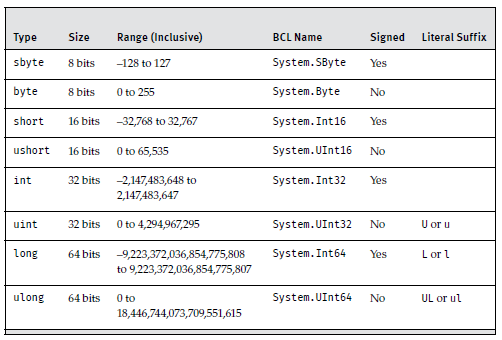
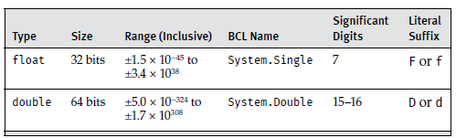
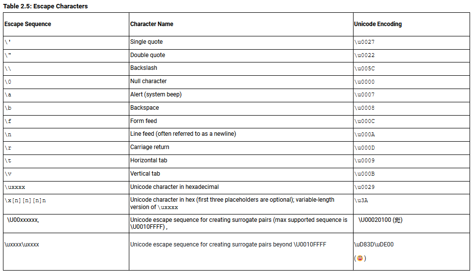

# Predefined Types

The C# languages predefined types include eight integer types, two binary floating-point types for scientific calculations and one decimal float for financial calculations, one Boolean type, one character type.

## Fundamental Numeric Types

### Integer Types



In C/C++, the `short` data type is an abbreeviation for `short int`. In C# `short` on its own is the actual data type.

### Floating Point Types

The accuracy of a floating point number is precise to a certain number of significant digits, not by a fixed value such as 0.01.
Starting with .NET Core 3.0, there are at most 17 significant digits for a double and 9 significant digits for a float.



### Decimal Type

a decimal floating point type with 128-bit precision. This type is suitable for financial calculations.

### Literal Values

A literal value is representation of a constant value within source code.

A literal number with a decimal point is by default a `double`, and with no decimal point is by default an `int` assuming the value is not too large to be stored in a 32-bit integer. If the value is larger it will be a `long`.

When using a literal number with a decimal point if the number is larger than the range of `double`, the precision drops to the precision of `double`. So the number is rounded to that range and extra digits are omitted.
To view the number as intended we must declare explicitly the literal value as a `decimal` type by appending its ***Literal Suffix*** which is `m` or `M`. Here M is for monetary values.

For large numbers that are difficult to read, C# 7.0 added support for a ***Digit Separator*** which is an underscore `_`.

We can also use exponential notation instead of writing out several zeroes before or after the decimal point.
We simply supply the `e` or `E` infix, followed with positive or negative integer and complete the literal with the appropriate data type suffix.

`6.023E23F`

### Hex & Binary Values

To specify a hex value, prefix the value with `0x` and then use any hexadecimal series of digits.
To specify a binary, prefix the value with `0b` and then use binary digits.

Starting with C# 7.2 you can place the digit separator after the x or b.

`Console.WriteLine($"0x{42:X}")` ==\> `0x2A`

The casing determines whether the hexadecimal letters appear in lowercase or uppercase.

### Round trip formatting

the round-trip format specifier returns a string that, if converted back into a numeric value, will always result in the original value.

`string.Format("{0:R}, 1.618033988749895")`

### Bool

Although theoretically a single bit could hold bool, the actual size is 1 byte.

### Char

16-bit characters whose set of possible values are drawn from the Unicode character set's UTF-16 encoding.
Char is the same size as `ushort`, (16-bit unsigned int, between 0 and 65,535).
some Unicode characters are composed of surrogate pairs of two char values.

A literal char is within single quotes, like \`A\`.



To represent any character with Unicode encoding, prefix the Unicode value with `\u`. We represent Unicode characters in hex notation.

### String

in C# we can use `@` in front of a string to signify that a backslash should not be interpreted as the beginning of an escape sequence.
The resultant ***verbatim string literal*** does not reinterpret just the backslash character. Whitespace is also taken verbatim.
The only escape sequence the verbatim string does support is " " which signifies double quotedd and does not terminate the string.

***Compiler Note***: If the same literal string appears within an assembly multiple times, the compiler will define the string only once within the assembly and all variables will refer to the same string.

Verbatim string literals can be combined with string iterpolation by specifying the `$` before `@` symbol ( `$@` ) starting in C# 8.0.

String interpolation is a shorthand for invoking the `string.Format()` method.

***[Raw string literals](https://essentialcsharp.com/raw-string-literals#raw-string-literals)***

If you want an actual left or right curly brace inside an interpolated string or formatted string, you can double the brace to indicate that it is not introducing a pattern.

`${{ {price:C2} }}` ==> `"{ $1,234.56}"`

On windows `System.WriteLine()` and `SystemConsole.Write(System.Environment.NewLine)` are equivalent to `System.Write("\r\n")` and not `"\n"`.

If considerable string modification is needed, such as when constructing a long string in multiple steps, you should use the data type `System.Text.StringBuilder` rather than `string`. The `StringBuilder` type includes methods such as `Append()`, `AppendFormat()`, `Insert()`, `Remove()`, and `Replace()`, some of which are also available with `string`. The key difference, however, is that with `StringBuilder` these methods will modify the data in the StringBuilder itself and will not simply return a new string.

## Conversions between data types
Any conversion that could result in a loss of data (such as magnitude and/or precision) or an exception because the conversion failed requires an ***explicit cast***. Conversely, a numeric conversion that will not lose magnitude and will not throw an exception regardless of the operand types is an ***implicit conversion***.

### Explicit Cast
We place the type we want to cast to inside parnathesis before the variable.

By default, if the target data type cannot contain the assigned data, the data will be truncated during assignment.
 However, placing the code within a checked block, or using the checked option when running the compiler, will cause the runtime to throw an exception of type `System.OverflowException`.
 
 ```C#
checked
{
    // int.MaxValue equals 2147483647
    int n = int.MaxValue;
    n = n + 1;
    Console.WriteLine(n);
} 
```

 **Output** 
`Unhandled Exception: System.OverflowException: Arithmetic operation resulted in an overflow at Program.Main() in ...Program.cs:line 12`

### Implicit Conversion
In other instances, such as when going from an int type to a long type, there is no loss of precision, and no fundamental change in the value of the type occurs. In these cases, the code needs to specify only the assignment operator; the conversion is ***implicit***.

Even when no explicit cast operator is required (because an implicit conversion is allowed), it is still possible to include the cast operator.

### Type Conversion without Casting 
Each numeric data type includes a `Parse()` function that enables conversion from a string to the corresponding numeric type.

We can also use `System.Convert` but it only supports a small amount of types and is not extensible.

All types support a `ToString()` method that can be used to provide a string representation of a type.

Check [TryParse](Type Conversion without Casting ) in the advanced topic of this part.

