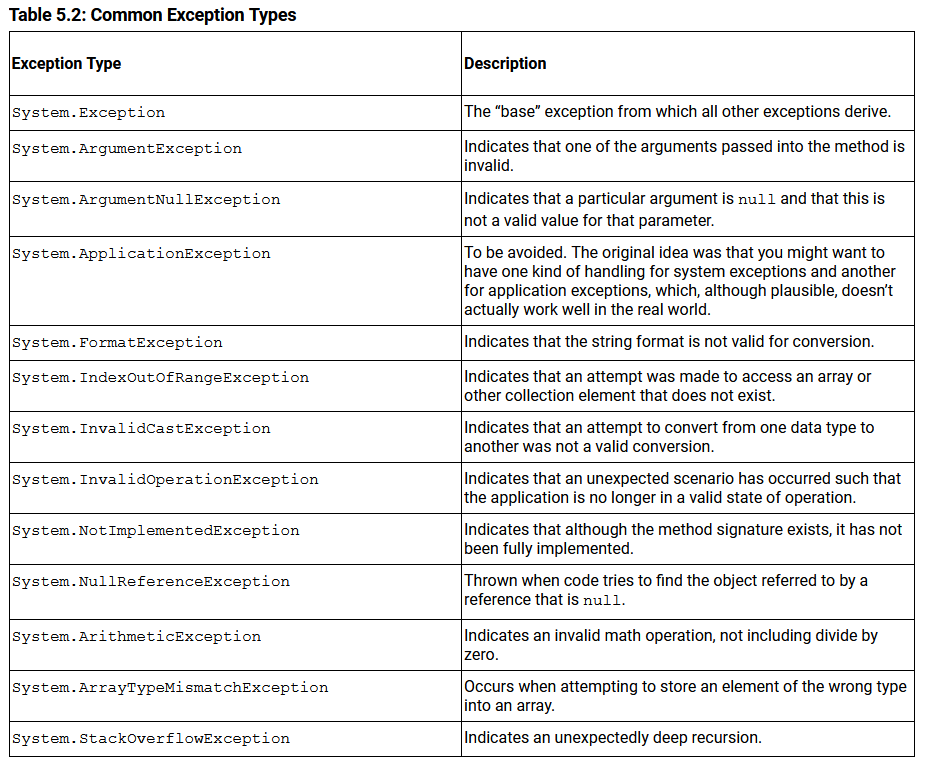

## Calling methods

A method is always associated with a type—usually a class—that provides a means of grouping related methods together.

A fully qualified method name includes a namespace, type name, and method name; a period separates each part of a fully qualified method name.

## Namespaces

Namespaces are a categorization mechanism for grouping all types related to a particular area of functionality.
Typically, the hierarchy begins with a company name, and then a product name, and then the functional area. For example, in `Microsoft.Win32.Networking`, the outermost namespace is `Microsoft`, which contains an inner namespace `Win32`, which in turn contains an even more deeply nested `Networking` namespace.

The `System` namespace contains the types that enable the programmer to perform many fundamental programming activities. Almost all C# programs use types within the `System` namespace.

* * *

C# provides no global method support; everything must appear within a type declaration. This is why the `Main()` method was marked as `static`.

Also, it is not possible to declare a local variable with the same name as a parameter of the containing method, because this would create two local variables of the same name.

A `void` method call may be used only as a statement. Furthermore, within the body of the method the `return` statement becomes optional, and when it is specified, there must be no value following the `return` keyword.

Although, technically, a method can have only one return type, the return type could be a tuple. As a result, starting with C# 7.0, it is possible to return multiple values packaged as a tuple using C# tuple syntax.

```C#
    static (string First, string Last) GetName()
   {
       string firstName, lastName;
       firstName = GetUserInput("Enter your first name: ");
       lastName = GetUserInput("Enter your last name: ");
       return (firstName, lastName);
   }
   static public void Main()
   {
       (string First, string Last) name = GetName();
       Console.WriteLine($"Hello { name.First } { name.Last }!");
   }
```

## Expression bodied methods

`static string GetFullName( string firstName, string lastName) =>`

In place of the curly brackets typical of a method body, an expression bodied method uses the “goes to” operator, for which the resulting data type must match the return type of the method. In other words, even though there is no explicit return statement in the expression bodied method implementation, it is still necessary that the return type from the expression match the method declaration’s return type.

# `using` Directives

It is possible to import all the types from one or more namespaces so that they can be used without full qualification.

[Implicit Using Statements](https://essentialcsharp.com/implicit-using-statements#implicit-using-statements)

[Global Using Directives](https://essentialcsharp.com/global-using-directives#global-using-directives)

he global using declarative, however, must appear before any other (non-global) using directives.

## `using static` Directive

The `using` directive allows you to abbreviate a type name by omitting the namespace portion of the name—such that just the type name can be specified for any type within the stated namespace. In contrast, the `using static` directive allows you to omit both the namespace and the type name from any static member of the stated type. A `using static System.Console` directive, for example, allows you to specify `WriteLine()` rather than the fully qualified method name of `System.Console.WriteLine()`

## Aliasing

The using directive also allows aliasing a namespace or type.

`using Timer = System.Timers.Timer;`

Simply adding a using `System.Timers` directive will not sufficiently enable the code to avoid fully qualifying the `Timer` type. The reason is that `System.Threading` also includes a type called `Timer`; therefore, using just `Timer` within the code will be ambiguous.
But because of the alias directive, “Timer” is not an ambiguous reference.

# Returns and Parameters on Main method

C# supports the ability to retrieve the command-line arguments when executing a program, and it is possible to return a status indicator from the Main method.

The runtime passes the command-line arguments to `Main()` using a single string array parameter – names args by convention. All you need to do to retrieve the parameters is to access the array.

The `Main()` method also returns an int rather than a void.
This is optional for a Main method declarations, but if it is used, the program can return an exit code to a caller (such as a script or a batch file). By convention, a return other than zero indicates an error.

Although all command-line arguments can be passed to `Main()` via an array of strings, sometimes it is convenient to access the arguments from inside a method other than `Main()`. The `System.Environment.GetCommandLineArgs()` method returns the command-line arguments array in the same form that `Main(string[] args)` passes the arguments into the `Main` method except that the first item in the array is the executable file name.

## Disambiguate Multiple Main Methods

If a program includes two classes with `Main`methods, it is possible to specify which one to use as the entry point. In Visual Studio, right-clicking on the project from Solution Explorer and selecting Properties provides a user interface on top of the project file. By selecting the Application tab on the left, you can edit the Startup Object and select which type’s Main method will start the program. The result will be an additional element in the `PropertyGroup`:

```
     <StartupObject>AddisonWesley.Michaelis.EssentialCSharp.Shared.Program

</StartupObject>
```

On the command line, you can specify the same value, setting the StartupObject property when running a build. For example:

`dotnet build /p:StartupObject=AddisonWesley.Program2`

where `AddisonWesley.Program2` is the namespace and class that contains the selected Main method. In fact, any item in the PropertyGroup section of a csproj file can be specified on the command line this way.)

* * *

[Top-Level Statements](https://essentialcsharp.com/top-level-statements#top-level-statements)
The compiler doesn’t allow top-level statements on programs that do not have Main methods (such as class libraries).

# Advanced Method Parameters

## Value Parameters

Values are copied into the scope of the method when it is called.
When the call stack unwinds at the end of a call, the copied data is thrown away.

When you pass a value type to a method, a copy of the value is made and passed to the method. Any changes made to the copy inside the method will not affect the original value outside the method. This is because value types are stored directly in memory and passed by value.

On the other hand, when you pass a reference type to a method, a copy of the reference is made and passed to the method. Both the original reference and the copy will refer to the same object in memory. As a result, if you modify the object inside the method, those changes will be visible outside the method because you are working with the same object.

It's important to note that passing a reference type without any special keywords (like ref or out) still allows you to modify the object's properties or fields, but it doesn't allow you to reassign the reference itself. If you want to modify the reference itself, you need to use the ref keyword in the method parameter declaration.

## Reference Parameters (`ref`)

We use this like `&` in C++ to pass by reference.
When the called method specifies a parameter as `ref`, the caller is required to supply a variable, not a value, as an argument and to place `ref` in front of the variables passed.

It is necessary to initialize any local variables passed as ref because target methods could read data from ref parameters without first assigning them.

## Output Parameters (`out`)

it is often the case that a method that takes a reference to a variable intends to write to the variable but not to read from it. In such cases, clearly it could be safe to pass an uninitialized local variable by reference.
To achieve this, code needs to decorate parameter types with the keyword `out`.
Each and every normal code path must result in the assignment of all out parameters.

[out in book](https://essentialcsharp.com/output-parameters-out#output-parameters-out)

## Read-Only Pass by Reference (`in`)

In C# 7.2, support was added for passing a value type by reference that was read only.
Rather than passing the value type to a function so that it could be changed, read-only pass by reference was added: It allows the value type to be passed by reference so that not only copy of the value type occurs but, in addition, the invoked method cannot change the value. In other words, the purpose of the feature is to reduce the memory copied when passing a value while still identifying it as read only, thus improving the performance.

## [Return by Reference](https://essentialcsharp.com/return-by-reference#return-by-reference)

There are two important restrictions on return by reference, both due to object lifetime: (1) Object references shouldn’t be garbage collected while they’re still referenced, and (2) they shouldn’t consume memory when they no longer have any references. To enforce these restrictions, you can only return the following from a reference-returning function:

- References to fields or array elements
- Other reference-returning properties or functions
- References that were passed in as parameters to the by-reference-returning function

We should remember these when returning by reference:
* If you’re returning a reference, you obviously must return it. This means, therefore, that in the example in Listing 5.19, even if no red-eye pixel exists, you still need to return a reference byte. The only workaround would be to throw an exception. In contrast, the by-reference parameter approach allows you to leave the parameter unchanged and return a bool indicating success. In many cases, this might be preferable.

* When declaring a reference local variable, initialization is required. This involves assigning it a ref return from a function or a reference to a variable:

`ref string text; // Error`

* Although it’s possible in C# 7.0 to declare a reference local variable, declaring a field of type ref isn’t allowed (see Chapter 6 - Instance Fields for more information on declaring fields):

`class Thing { ref string _Text; /* Error */ }`

* You can’t declare a by-reference type for an auto-implemented property (see Chapter 6 – Properties for more information on declaring auto-properties):

`class Thing { ref string Text { get;set; } /* Error */ }`

* Properties that return a reference are allowed (see Chapter 6 – Properties for more information on declaring properties):
```
class Thing { string _Text = "Inigo Montoya";
	ref string Text { get { return ref _Text; } } 
}
```

* A reference local variable can’t be initialized with a value (such as null or a constant). It must be assigned from a by-reference-returning member or a local variable, field, or array element:

`ref int number = 42; // ERROR`

# Method Overloading
All methods within a class must have a unique signature, and C# defines uniqueness by variation in the method name, parameter data types, or number of parameters. This does not include method return data types; defining two methods that differ only in their return data types will cause a compile error. This is true even if the return type is two different tuples. ***Method overloading*** occurs when a class has two or more methods with the same name and the parameter count and/or data types vary between the overloaded methods.

Method overloading is a type of ***operational polymorphism***. Polymorphism occurs when the same logical operation takes on many (“poly”) forms (“morphs”) because the data varies.

The idea is that developers implement only the core logic in one method, and all the other overloaded methods will call that single method. If the core implementation changes, it needs to be modified in only one location rather than within each implementation. This pattern is especially prevalent when using method overloading to enable optional parameters that do not have values determined at compile time, so they cannot be specified using optional parameters.

# Optional Parameters
optional parameters must appear after all required parameters (those that don’t have default values). Also, the fact that the default value needs to be a constant, compile-time–resolved value is fairly restrictive.

## Named Arguments
With named arguments, it is possible for the caller to explicitly identify the name of the parameter to be assigned a value, rather than relying solely on parameter and argument order to correlate them.

```c#
public static void Main()
{
    DisplayGreeting(
        firstName: "Inigo", lastName: "Montoya");
}
 
public static void DisplayGreeting(
			string firstName,
			string? middleName = null,
			string? lastName = null
    )
{
    // ...
} 
```

For cases where a method has lots of parameters and many of them are optional, using the named argument syntax is certainly a convenience. However, along with the convenience comes an impact on the flexibility of the method interface. In the past, parameter names could be changed without causing C# code that invokes the method to no longer compile. With the addition of named parameters, the parameter name becomes part of the interface because changing the name would cause code that uses the named parameter to no longer compile.

treat parameter names as part of the API, and avoid changing the names if version compatibility between APIs is important. 

## Method Resolution

When the compiler must choose which of several applicable methods is the best one for a particular call, the one with the most specific parameter types is chosen. Assuming there are two applicable methods, each requiring an implicit conversion from an argument to a parameter type, the method whose parameter type is the more derived type will be used.

For example, a method that takes a double parameter will be chosen over a method that takes an object parameter if the caller passes an argument of type int. This is because double is more specific than object. There are objects that are not doubles, but there are no doubles that are not objects, so double must be more specific.

If more than one method is applicable and no unique best method can be determined, the compiler will issue an error indicating that the call is ambiguous.

# Exception Handling
One or more catch blocks (or the finally block) must appear immediately following a try block. The catch block header (see Advanced Topic: General Catch later in this chapter) optionally allows you to specify the data type of the exception. As long as the data type matches the exception type, the catch block will execute. If, however, there is no appropriate catch block, the exception will fall through and go unhandled as though there were no exception handling. 



## General Catch

It is possible to specify a catch block that takes no parameters.

Sometimes a catch block will trap an exception but be unable to handle it appropriately or fully. In these circumstances, a catch block can rethrow the exception using the throw statement without specifying any exception.

```C#
catch (Exception exception)
{
    Console.WriteLine(
        "Rethrowing unexpected error:  "
        + $"{ exception.Message }");
 
    throw;
} 
```

 `throw;` preserves the call stack information in the exception, whereas `throw exception;` replaces that information with the current call stack information. For debugging purposes, it is usually better to know the original call stack. Of course, this is only allowed in a catch statement where the caught exception can be determined.
 
 ## Reporting Null Argument Exceptions 
 verify that non-null reference types parameters are not null and throw an `ArgumentNullException` when they are.
 use `ArgumentException.ThrowIfNull()` to verify values are null in .NET 7.0 or later.
 
 ## [Avoid Using Exception Handling to Deal with Expected Situations](https://essentialcsharp.com/avoid-using-exception-handling-to-deal-with-expected-situations#avoid-using-exception-handling-to-deal-with-expected-situations)
 
 