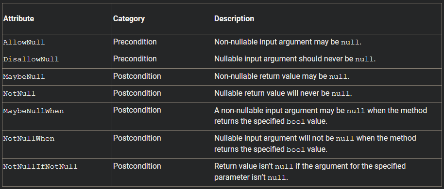

# Instantiating a Class

C# programmers should view the new operator as a call to instantiate an object, not as a call to allocate memory. Both objects allocated on the heap and objects allocated on the stack support the new operator, emphasizing the point that new is not about how memory allocation should take place and whether de-allocation is necessary.

Thus, C# does not need the `delete` operator found in C++. Memory allocation and de-allocation are details that the runtime manages, allowing the developer to focus more on domain logic. However, although memory is managed by the runtime, the runtime does not manage other resources such as database connections, network ports, and so on. Unlike C++, C# does not support implicit deterministic resource cleanup (the occurrence of implicit object destruction at a compile-time–defined location in the code). Fortunately, C# does support explicit deterministic resource cleanup via a `using` statement and implicit nondeterministic resource cleanup using finalizers.

# Using the `this` Keyword

Use of this is implicit when calling any instance member, and it returns an instance of the object itself.

# Properties

Property definition syntax uses three contextual keywords. You use the `get` and `set` keywords to identify either the retrieval or the assignment portion of the property, respectively. In addition, the setter uses the `value` keyword to refer to the right side of the assignment operation.

Different ways to define a property:

```C#
public class Employee
{
    // FirstName property
    public string FirstName
    {
        get
        {
            return _FirstName;
        }
        set
        {
            _FirstName = value;
        }
    }
    private string _FirstName;
    // LastName property
    public string LastName
    {
        get => _LastName;
        set => _LastName = value;
    }
    private string _LastName;
    // ...
} 
```

## Automatically Implemented Properties

Automatic property in C# is a property that has backing field generated by compiler.

```C#
  // Title property
    public string? Title { get; set; }
 
    // Manager property
    public Employee? Manager { get; set; }
 
    public string? Salary { get; set; } = "Not Enough"; 
```

One final thing to note about automatically declared properties is that it is possible to initialize them.
The general guideline is that methods should represent actions and properties should represent data. Properties are intended to provide simple access to simple data with a simple computation. The expectation is that invoking a property will not be significantly more expensive than accessing a field.

to respect the principles of encapsulation, ***fields*** should not be declared as public or protected.

DO use properties for simple access to simple data with simple computations.
AVOID throwing exceptions from property getters.
DO preserve the original property value if the property throws an exception.
DO favor automatically implemented properties over properties with simple backing fields when no additional logic is required.
DO favor prefixing Boolean properties with “Is,” “Can,” or “Has,” when that practice adds value.
DO favor automatically implemented properties over fields.
DO declare all instance fields as private (and expose them via a property).

## Read-Only and Write-Only Properties

By removing either the getter or the setter portion of a property, you can change a property’s accessibility. Properties with only a setter are write-only, which is a relatively rare occurrence. Similarly, providing only a getter will cause the property to be read-only, any attempts to assign a value will cause a compile error.

When declaring a property as read-only, we cannot write to it, so in order to set the value we can use the private backing field only inside the class itself. Giving read only access to all other objects calling the property to access the field.

There is also support for read-only, ***automatically implemented*** properties, as follows:

`public bool[,,] Cells { get; } = new bool[2, 3, 3];`

One important note about a read-only automatically implemented property is that, like read-only fields, the compiler requires that such a property be initialized via an initializer (or in the constructor).

## Access Modifiers on Getters and Setters

An access modifier can appear on either the get or the set portion of the property implementation (not on both), thereby overriding the access modifier specified on the property declaration.

By using private on the setter, the property appears as read-only to classes other than itself. From within itself, the property appears as read/write, so you can assign the property within the class itself. When specifying an access modifier on the getter or setter, take care that the access modifier is more restrictive than the access modifier on the property as a whole. It is a compile error, for example, to declare the property as private and the setter as public.

## Properties and Method Calls Not Allowed as `ref` or `out` Parameter Values

C# allows properties to be used identically to fields, except when they are passed as `ref` or `out` parameter values. `ref` and `out` parameter values are internally implemented by passing the memory address to the target method. However, because properties can be virtual fields that have no backing field or can be read-only or write-only, it is not possible to pass the address for the underlying storage. As a result, you cannot pass properties as ref or out parameter values. The same is true for method calls. Instead, when code needs to pass a property or method call as a ref or out parameter value, the code must first copy the value into a variable and then pass the variable. Once the method call has completed, the code must assign the variable back into the property.

# Constructors

to define a constructor, you create a method with no return type, whose method name is identical to the class name. The constructor is the method that the runtime calls to initialize an instance of the object.

The new operator retrieves “empty” memory from the memory manager and then calls the specified constructor, passing a reference to the empty memory to the constructor as the implicit this parameter. Next, the remainder of the constructor chain executes, passing around the reference between constructors. None of the constructors have a return type; behaviorally they all return void. When execution of the constructor chain is complete, the new operator returns the memory reference, now referring to the memory in its initialized form.

If a class has no explicitly defined constructor, the C# compiler adds one during compilation. This constructor takes no parameters so, by definition, it is the default constructor. As soon as you add an explicit constructor to a class, the C# compiler no longer provides a default constructor.

programmers can define a default constructor explicitly—perhaps one that initializes some fields to particular values. Defining the default constructor simply involves declaring a constructor that takes no parameters.

A ***copy constructor*** is a constructor that takes a single parameter of the containing type. For example:

```
public Employee(Employee original)
{
     // Copy properties between employees here.
}
```

Constructors like this are useful for cloning an instance of an object into a new duplicate instance.

## Object Initializers

To initialize an object’s accessible fields and properties, you can use the concept of an ***object initializer***—a set of member initializers enclosed in curly braces following the constructor call to create the object. Each member initializer is the assignment of an accessible field or property name with a value.

`Employee employee = new("Inigo", "Montoya") { Title = "Computer Nerd", Salary = "Not enough" };`

### Init Only Setters

Object initializers allow for specifying member values during object initialization. Any read-only properties cannot be set this way, however, because properties with only getters may only be set during object construction and object initializers runs after this. To address the problem, C# 9.0 added support for `init` only setters, which can be set from within object initializers but not afterward.

```C#
public string? Salary
    {
        get => _Salary;
        init => _Salary = value;
    } 
```

## Finalizers

Constructors define what happens during the instantiation process of a class. To define what happens when an object is destroyed, C# provides the finalizer construct. Unlike destructors in C++, finalizers do not run immediately after an object goes out of scope. Rather, the finalizer executes at some unspecified time after an object is determined to be “unreachable.” Specifically, the garbage collector identifies objects with finalizers during a garbage collection cycle, and instead of immediately de-allocating those objects, it adds them to a finalization queue. A separate thread runs through each object in the finalization queue and calls the object’s finalizer before removing it from the queue and making it available for the garbage collector again.

## Overloading Constructors

you can have more than one constructor if the number or types of the parameters vary.

## Constructor Chaining: Calling Another Constructor Using `this`

The amount of code is small, but there are ways to eliminate the duplication by calling one constructor from another—a practice known as ***constructor chaining***—using ***constructor initializers***. Constructor initializers determine which constructor to call before executing the implementation of the current constructor.

To call one constructor from another within the same class (for the same object instance), C# uses a colon followed by the this keyword, followed by the parameter list on the called constructor’s declaration. In this case, the constructor that takes all three parameters calls the constructor that takes two parameters. Often, this calling pattern is reversed—that is, the constructor with the fewest parameters calls the constructor with the most parameters, passing defaults for the parameters that are not known.

## `required` Modifier

In C# 11, the designers add the ability to mark either a field or a property as required.
This designates them as “required” such that they must be assigned inside the object initializer during construction.

```C#
string? _Title;
    public required string Title
    {
        get
        {
            return _Title!;
        }
        set
        {
            _Title = value ?? throw new ArgumentNullException(nameof(value));
        }
    }
    
    // in Main
    Book book = new()
        {
            Title = "Harold and the Purple Crayon"
        }; 
```

Providing a constructor with parameters for the required members will result in having to specify the values both as constructor arguments and, redundantly, in the object initializer.

# Nullable Attributes

There are seven different nullable attributes, each defined in the `System.Diagnostics.CodeAnalysis` namespace and identified as either pre-conditions or post-conditions



It is helpful to have such attributes because occasionally, the nullability of the data type is insufficient. You can overcome this insufficiency with an attribute that decorates either incoming (a pre-condition nullable attribute) or outgoing (a post-condition nullable attribute) data on a method. The pre-condition communicates to the caller whether the value specified is intended to be null, whereas the post-condition communicates to the caller about the nullability of the outgoing data.

# Deconstructors

In C#, deconstructors are a language feature that allows you to extract the values from an object into individual variables or elements of a tuple. Deconstructors are particularly useful when working with tuples because they simplify the process of extracting and using the elements of a tuple in a more concise and expressive manner.

A deconstructor is a special method within a C# class or struct that enables you to break down an object into its individual components (fields or properties). When you want to deconstruct an object, you can use it in the context of a tuple. ^9d22d1

Here's the general syntax for a deconstructor:

```csharp
public void Deconstruct(out T1 value1, out T2 value2, ..., out TN valueN)
{
    // Assign values to the out parameters
    value1 = // some value
    value2 = // some value
    // ...
    valueN = // some value
}
```

To use a deconstructor, you need to call it in the context of a tuple or a similar pattern. The number of elements in the tuple should match the number of `out` parameters in the deconstructor.

Here's an example of a class with a deconstructor:

```csharp
public class Person
{
    public string Name { get; set; }
    public int Age { get; set; }

    public void Deconstruct(out string name, out int age)
    {
        name = Name;
        age = Age;
    }
}
```

Now, you can create a `Person` object and deconstruct it into separate variables:

```csharp
var person = new Person { Name = "Alice", Age = 30 };
var (personName, personAge) = person; // Deconstruction
```

# [Static Members](https://essentialcsharp.com/static-fields#static-fields)

C# does not have global variables or global functions. All fields and methods in C# appear within the context of a class. The equivalent of a global field or function within the realm of C# is a static field or function. There is no functional difference between global variables/functions and C# static fields/methods, except that static fields/methods can include access modifiers, such as `private`, that can limit the access and provide better encapsulation.

To define data that is available across multiple instances, you use the `static` keyword.

A single storage location is shared across all instances of the containing class.

Just as instance fields (non-static fields) can be initialized at declaration time, so can static fields.

Unlike with instance fields, if no initialization for a static field is provided, the static field will automatically be assigned its default value (0, null, false, and so on)—the equivalent of `default(T)`, where T is the name of the type. As a result, it will be possible to access the static field even if it has never been explicitly assigned in the C# code.

it is not possible to define a static field and an instance field with the same name in the same class.

## Static Methods

Because static methods are not referenced through a particular instance, the `this` keyword is invalid inside a static method.
it is not possible to access either an instance field or an instance method directly from within a static method without a reference to the instance to which the field or method belongs.

## Static Constructors

Static constructors are provided as a means to initialize the class itself rather than the instances of a class. Such constructors are not called explicitly; instead, the runtime calls static constructors automatically upon first access to the class, whether by calling a regular constructor or by accessing a static method or field on the class. Because the static constructor cannot be called explicitly, no parameters are allowed on static constructors.

You use static constructors to initialize the static data within the class to a particular value, primarily when the initial value involves more complexity than a simple assignment at declaration time.

If assignment of static members occurs within both the static constructor and the declaration, it is not obvious what the value will be when initialization concludes. The C# compiler generates CIL in which the declaration assignment is moved to be the first statement within the static constructor. Therefore, static members will contain the value returned by the static constructure instead of a value assigned during static member’s declaration. Assignments within the static constructor, therefore, will take precedence over assignments that occur as part of the field declaration, as was the case with instance fields.

Be careful not to throw an exception from a static constructor, as this will render the type unusable for the remainder of the application’s lifetime.

## Static Properties

It is almost always better to use a static property rather than a public static field, because public static fields are callable from anywhere, whereas a static property offers at least some level of encapsulation.

## Static Classes

Some classes do not contain any instance fields.
A static class cannot have instance fields and methods.
Another distinguishing characteristic of the static class is that the C# compiler automatically marks it as `abstract` and `sealed` within the CIL. This designates the class as ***inextensible***; in other words, no class can be derived from this class or even instantiate it.

# Extension Methods

You can simulate the creation of an instance method on a different class via extension methods.
To do this, we simply change the signature of our static method so that the first parameter—that is, the data type we are extending—is prefixed with the `this` keyword.

Keep in mind that extension methods have some limitations. For instance, they cannot access private members of the type they are extending, and they won't be available unless you include the namespace where the static class containing the extension methods is defined.

Despite their appearance when using them as instance methods on the target type, they are still just static methods in a static class.

When you define an extension method, you're essentially providing syntactic sugar that allows you to call the method as if it were an instance method on the target type, even though it's a static method defined in a separate static class.
behind the scenes, the compiler translates the call into a call to the static method in the extension class and passes the instance of the string as the first parameter. This is why you have to use the this keyword as the first parameter in the method signature - it tells the compiler that this is an extension method for the specified type.

# Encapsulating the Data

## const

Just as with const values, a const field contains a compile-time–determined value that cannot be changed at runtime.

<ins>Constant fields are static</ins>, since no new field instance is required for each object instance. Declaring a constant field as static explicitly will cause a compile error. Also, constant fields are usually declared only for types that have literal values (e.g., string, int, and double). Types such as \`or \` cannot be used for constant fields.

## readonly

Unlike const, the readonly modifier is available only for fields (not for local variables). It declares that the field value is modifiable only from inside the constructor or via an initializer.

read-only fields occur as either instance or static fields.

Another key distinction is that you can assign the value of a read-only field at execution time rather than just at compile time.

`readonly` fields are not limited to types with literal values.

Whether read-only automatically implemented properties or the readonly modifier on a field, ensuring immutability of the array reference is a useful defensive coding technique. It ensures that the array instance remains the same, while allowing the elements within the array to change. Without the read-only constraint, it would be all too easy to mistakenly assign a new array to the member, thereby discarding the existing array rather than updating individual array elements. In other words, using a read-only approach with an array does not freeze the contents of the array. Rather, it freezes the array instance (and therefore the number of elements in the array) because it is not possible to reassign the value to a new instance. The elements of the array are still writeable.

# Partial Classes

Partial classes are portions of a class that the compiler can combine to form a complete class. Although you could define two or more partial classes within the same file, the general purpose of a partial class is to allow the splitting of a class definition across multiple files. Primarily this is useful for tools that are generating or modifying code. With partial classes, the tools can work on a file separate from the one the developer is manually coding.

C# allows declaration of a partial class by prepending a contextual keyword, `partial`, immediately before `class`.

```C#
// File: Program1.cs
partial class Program
{
}
// File: Program2.cs
partial class Program
{
} 
```

Partial classes do not allow for extending compiled classes or classes in other assemblies. They are simply a means of splitting a class implementation across multiple files within the same assembly.

## [Partial Methods](https://essentialcsharp.com/partial-methods#partial-methods)

Extending the concept of partial classes is the concept of partial methods,20 which are allowed only within partial types. Like partial classes, their primary purpose is to accommodate code generation.

Partial methods allow for a declaration of a method without requiring an implementation. However, when the optional implementation is included, it can be located in one of the sister partial class definitions—likely in a separate file.

The signature for the partial methods must match.

Prior to C# 9.0, partial methods must return void. If the method didn’t return void and the implementation was not provided, what would the expected return be from a call to a non-implemented method? To avoid any invalid assumptions about the return, the C# designers decided to prohibit methods with returns other than void. Similarly, out parameters are not allowed on partial methods. If a return value is required, ref parameters may be used. Lastly, partial members cannot be decorated with an accessibility modifier (e.g., private or public). Rather, partial methods are implicitly private.

Starting with C# 9.0, these restrictions were all removed. Partial methods could return values, have out parameters, and even have access modifiers. In fact, distinguishing this unrestricted version of a partial method, C# required the access modifier, even for methods that were intended to be private. To remove the restrictions, C# 9.0 required that all partial methods with access modifiers also had an accompanying method pair with the implementation. As demonstrated by Listing 6.58, if you declared a partial member as public string `GetName()` with no implementation, you were also required to have a second partial method declaration with the same signature and with the implementation, such as public partial string `GetName() => $"{FirstName} {LastName}"`. In this way, the C# compiler ensured that any return values (including returns via out parameters) were successful because, in fact, the method had an implementation.