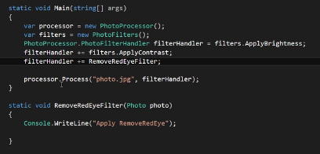

# What is a Delegate

It is a group of objects that knows how to call a method (or a group of methods).
Basically it is a reference/pointer to a function.

It is good for designing extensible and flexible applications(eg frameworks)

C# delegates are objects that hold references to methods or functions, and allow you to call those methods or functions at a later time. In other words, a delegate is a type-safe function pointer.

***MSDN***
A delegate declaration defines a reference type that can be used to encapsulate a method with a specific signature. A delegate instance encapsulates a static or an instance method. Delegates are roughly similar to function pointers in C++; however, delegates are type-safe and secure

Delegates are commonly used in C# for implementing event handlers and callbacks. For example, when you subscribe to an event in C#, you are actually adding a delegate as a callback method to the event. When the event occurs, the delegate is invoked, which in turn calls the associated method.

Here's a simple example that demonstrates the use of delegates:

```csharp
public delegate int MyDelegate(int x, int y);

public class Calculator
{
    public int Add(int x, int y)
    {
        return x + y;
    }

    public int Multiply(int x, int y)
    {
        return x * y;
    }
}

public class Program
{
    static void Main()
    {
        Calculator calculator = new Calculator();
        MyDelegate addDelegate = new MyDelegate(calculator.Add);
        MyDelegate multiplyDelegate = new MyDelegate(calculator.Multiply);

        int result1 = addDelegate(1, 2); // result1 = 3
        int result2 = multiplyDelegate(3, 4); // result2 = 12
    }
}
```

In this example, we define a delegate named `MyDelegate` that takes two `int` parameters and returns an `int`. We then create an instance of the `Calculator` class and use the `Add` and `Multiply` methods as arguments to create two delegate instances. Finally, we call the delegate instances passing in some values, which in turn call the associated method and return the result.

Overall, delegates provide a powerful and flexible way to encapsulate methods and pass them around as objects in C#.

* * *

We create a delegate in our class which might use different methods to approach something based on the input. Like the way we used interfaces and polymorphism.
We can use delegates here as well.
Once we have created a delegate member in our class,
In the client program, we can add methods to the delegate member and it will hold the reference to those methods.



* * *

# Existing .Net Delegates

- Action: Points to a method that returns void
- Func: points to a methods that returns a value
    These delegates are also generics. We can just use these instead of creating our custom delegates and pass whatever values our delegate needs.

# Delegates or Interfaces

We use a delegate when:

- An eventing design pattern is used
- The caller doesn't need to access other properties or methods on the object implementing the method