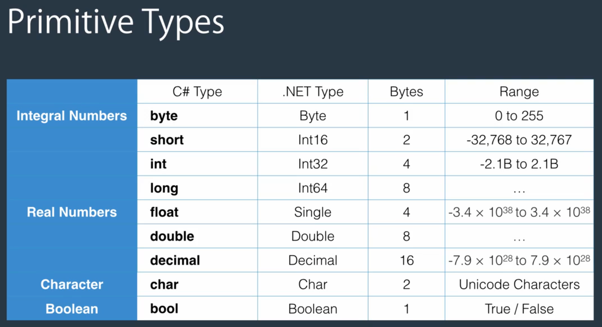
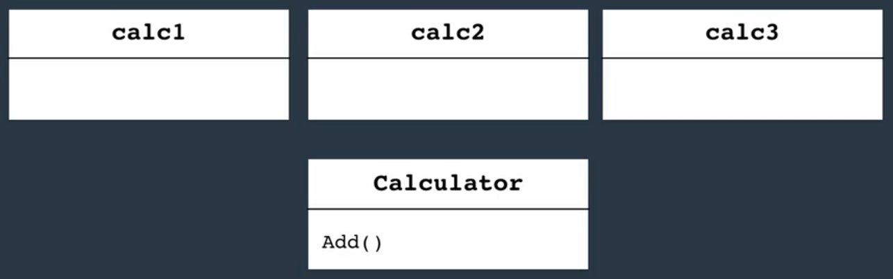
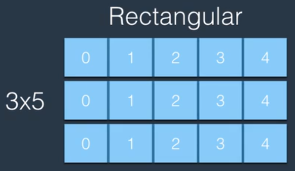
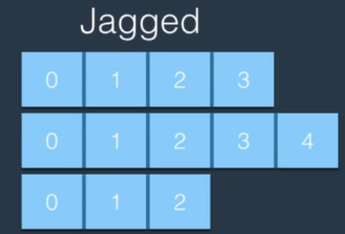
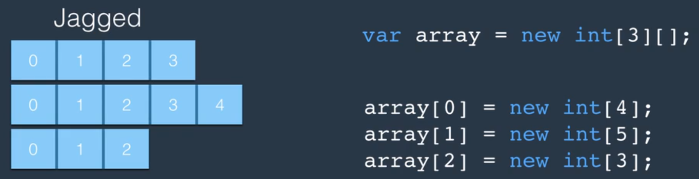
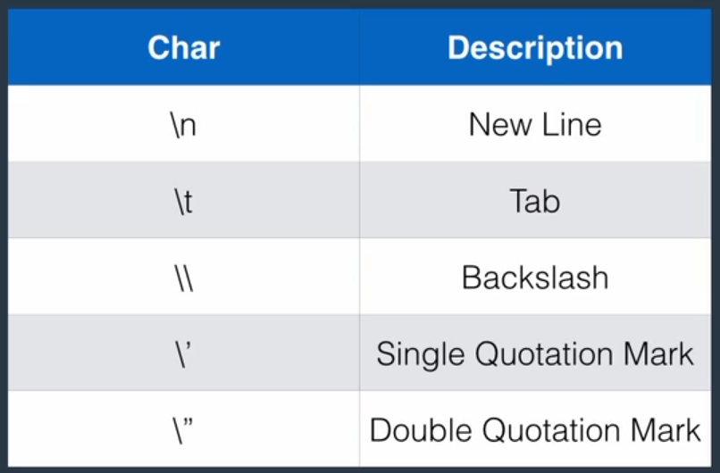
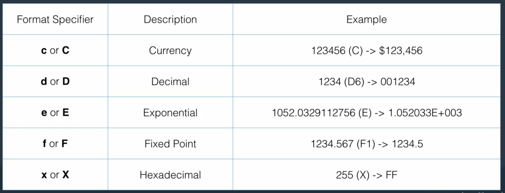

# C# vs .Net

- C# is a programming language
- .Net is a framework for building applications

## .Net framework

This framework is made up of 2 components:

- CLR ***(Common Language Runtime)***
- Class Library

### CLR

Translates ***Intermediate Language*** to ***Machine Language***. All C# code is first translated to IL code first regardless of the machine it is running on. This process is called ***just-in-time compilation (JIT)***

## Architecture of .Net apps

A c# app consists of multiple classes in touch with each other.
As the number of classes in an application grows, we need a way to organize them. We use ***Namespaces*** to do that. A namespace is a container for related classes.
As namespaces grow, we use an ***Assembly*** to partition an application. It is a container for related namespaces. It can either be an **EXE** or a **DLL** (*Dynamically Linked Library*).
When compiling an application, the compiler builds one or more assemblies depending on how you partition your code.

### Writing to Console

We can use `Console.WriteLine()` to write something to console then go to the next line.
And we can use `Console.Write()` to write to the console but not go to the next line.

# Primitive Data Types

These are ***Value Types***. value types are stored in the ***stack***.



The `double` data type is the default data type used by the C# compiler when using real numbers. So to use `float` types we have to explicitly tell the compiler like so:
`float num = 1.2f;`
and for the `decimal` type:
`decimal num = 1.2m;`

# Non-Primitive Data Types

These are ***reference*** types. Reference types are stored in ***heap***.

- String
- Array
- Enum
- Class

### Overflow

To prevent overflowing in C# we use the `checked {}` keyword. anything inside this block will be checked for overflowing and will throw an exception at runtime.

### var keyword

The `var` keyword detects the data type automatically instead of specifying it ourself.

# Explicit Data Type Conversion

When we have to change a type to one that the compiler doesn't normally allow we have to tell the compiler to explicitly change the type like so:

```c#
string s = "1";
char c = (char)s;
```

for non-compatible types we have to use classes such as `Convert` or `Parse` methods:

```c#
string s = "1";
int i = Convert.ToInt32(s);
int j = int.Parse(s);
```

All integral types have the `Parse()` method which takes a string and tries to convert it to the type.

### Converting char to int

To convert char to int, since each char has an ASCII representation as well, we cannot simply use `(int)` to convert it. There are two ways I found that work:

1.  `int n = int.Parse(character.ToString());`
2.  `int n = (int)Char.GetNumericValue(item);` This one returns a double so we convert it to int.

## static modifier

We use the `static` modifier in methods of classes when we only need one instance of that method.
Take a method called `add()` in a `Calculator` class. With the `static` keyword the compiler handles the method in memory like this:



instead of creating the method in memory for every instance of calculator. this method is created once in memory and is used by all instances of this class. Basically a static member of a class is accessible only through the class itself not its instances.

With C# 6, you can import static classes into your using statements:
```C#
using static System.Console;
```

Note the use of static keyword after using.

With that, you can call the WriteLine method without prefixing it with its class name:
```C#
public class Program
{
    public static void Main()
    {
         WriteLine("Hello World");
    }
}
```

### Value Type vs Reference Type

Check [this](https://www.tutorialsteacher.com/csharp/csharp-value-type-and-reference-type) link for a detailed difference.

# Struct

Structs are value types whereas classes are reference types. this is the main difference between the two.

In .NET, there are two categories of types, reference types and value types.

Structs are value types and classes are reference types.

The general difference is that a reference type lives on the heap, and a value type lives inline, that is, wherever it is your variable or field is defined.

A variable containing a value type contains the entire value type value. For a struct, that means that the variable contains the entire struct, with all its fields.

A variable containing a reference type contains a pointer, or a reference to somewhere else in memory where the actual value resides.

This has one benefit, to begin with:

- value types always contains a value
- reference types can contain a null-reference, meaning that they don't refer to anything at all at the moment

Internally, reference types are implemented as pointers, and knowing that, and knowing how variable assignment works, there are other behavioral patterns:

- copying the contents of a value type variable into another variable, copies the entire contents into the new variable, making the two distinct. In other words, after the copy, changes to one won't affect the other
- copying the contents of a reference type variable into another variable, copies the reference, which means you now have two references to the same somewhere else storage of the actual data. In other words, after the copy, changing the data in one reference will appear to affect the other as well, but only because you're really just looking at the same data both places

When you declare variables or fields, here's how the two types differ:

- variable: value type lives on the stack, reference type lives on the stack as a pointer to somewhere in heap memory where the actual memory lives (though note [Eric Lippert's article series: The Stack Is An Implementation Detail](https://learn.microsoft.com/en-us/archive/blogs/ericlippert/the-stack-is-an-implementation-detail-part-one).)
- class/struct-field: value type lives completely inside the type, reference type lives inside the type as a pointer to somewhere in heap memory where the actual memory lives.

# Arrays

In C# all arrays map to the array type that is defined in the system namespace of .Net framework.
`int[] numbers = new int[3]{1, 2, 3};`
An array is an object because there is a class called array which the compiler makes an object of, thus the `new` keyword.

## Multi Dimensional Arrays

We have two types of multi dimensional arrays in C#:

1.  Rectangular
2.  Jagged



`var matrix = new int[3, 5];`



### Declaring Jagged arrays



A way to understand Jagged arrays is to have an array of arrays.
each array inside that can have a different length.

In .Net, CLR is optimized around single dimension arrays. So if we have a matrix model, it's faster to implement it using jagged arrays than rectangular arrays.

## Array Method

Most array methods are static. This means you have to call them on `Array`. But `length` is not static and must be called on an instance of an array.
Array methods:

- `Array.IndexOf()`
- `Array.Clear()`
- `Array.Copy()`
- `Array.Sort()`
- `Array.Reverse()`

# Lists

A list is a data structure for storing a number of objects of the same type but with ***Dynamic Size***. A list is a generic type. We make a list like this:
`var numbers = new List<int>();`

## List Methods

- `Add()`
- `AddRange()`
- `Remove()`
- `RemoveAt()`
- `IndexOf()`
- `Contains()`
- `Count`

## Modifying a collection

In c# we are not allowed to modify our collection inside a foreach loop. we have to use a normal for loop instead.

## ArrayList

We also have an `ArrayList` type, which unlike `List` can have members of different types.
`var list = new ArrayList();`

# LinkedList
The main difference between `LinkedList<T>` and `List<T>` in C# is the way they store and access their elements.

`List<T>` is an implementation of a dynamic array that provides fast element access by index. It stores its elements in a contiguous block of memory, which allows for efficient random access to elements.

`LinkedList<T>`, on the other hand, is an implementation of a doubly linked list that provides fast element insertion and deletion at any position in the list. It stores its elements in individual nodes that are linked together, which makes it more efficient for operations that require adding or removing elements in the middle of the list.

Here are some key differences between `List<T>` and `LinkedList<T>`:

- Accessing elements: `List<T>` provides fast random access to elements by index, while `LinkedList<T>` requires traversal of the list to access elements by index.
- Insertion and deletion: `LinkedList<T>` provides fast insertion and deletion of elements at any position in the list, while `List<T>` can be less efficient for operations that require adding or removing elements in the middle of the list.
- Memory usage: `LinkedList<T>` uses more memory than `List<T>` because it stores each element in a separate node that contains pointers to the previous and next nodes in the list.

In general, if you need to frequently add or remove elements from a list at any position, `LinkedList<T>` can be a better choice. If you need fast random access to elements by index, `List<T>` is usually a better choice.

## implementing LinkedList in C#

While C# doesn't have explicit pointers like C and C++, you can still create a custom linked list implementation in C# using object references.

Instead of using pointers to reference nodes in the linked list, you can use object references to reference the next node in the list. Each node in the linked list would be represented as an object that contains a reference to the next node in the list.

Here's an example of a custom linked list implementation in C#:

```csharp
public class Node<T>
{
    public T Data { get; set; }
    public Node<T> Next { get; set; }

    public Node(T data)
    {
        Data = data;
        Next = null;
    }
}

public class LinkedList<T>
{
    private Node<T> head;

    public void AddFirst(T data)
    {
        Node<T> newNode = new Node<T>(data);
        newNode.Next = head;
        head = newNode;
    }

    public void AddLast(T data)
    {
        Node<T> newNode = new Node<T>(data);

        if (head == null)
        {
            head = newNode;
            return;
        }

        Node<T> current = head;
        while (current.Next != null)
        {
            current = current.Next;
        }

        current.Next = newNode;
    }

    public void PrintList()
    {
        Node<T> current = head;

        while (current != null)
        {
            Console.WriteLine(current.Data);
            current = current.Next;
        }
    }
}
```

This implementation defines a `Node<T>` class that represents a single node in the linked list. The `LinkedList<T>` class uses the `Node<T>` class to implement a custom linked list. The `LinkedList<T>` class contains methods to add nodes to the beginning or end of the list, as well as a method to print the contents of the list to the console.

This custom linked list implementation uses object references instead of pointers to reference nodes in the list. The `Next` property of each `Node<T>` object is used to reference the next node in the list.

Note that while this implementation uses object references instead of pointers, it still provides the same functionality as a traditional linked list implementation.


# Strings

`string`s are covered by `""` unlike `char` which is surrounded by `''`.

`string name = string.Format("{0} {1}", firstName, lastName);`

We can turn an array into a string like this:

```c#
var numbers = new int[3]{1,2,3};
string list = string.Join(",", numbers);
```

***Strings are immutable***
once we create a string, we cannot change it. Methods that change a string, return a new string.

To check whether a string is empty we use `String.IsNullOrWhiteSpace(variable)`.

Another way to create strings in C# is the String class. It takes a few arguments depending on the scenario. Sometimes we have an array of characters we want to turn into strings:

```c#
var chars = new char[10];
var text = new String(chars); // creates a string with the characters in the char array
```

### Escape Characters



## Verbatim Strings

To indicate that a string literal is to be interpreted verbatim. The `@` character in this instance defines a verbatim string literal. Simple escape sequences (such as `\\` for a backslash), hexadecimal escape sequences (such as "\\x0041" for an uppercase A), and Unicode escape sequences (such as "\\u0041" for an uppercase A) are interpreted literally. Only a quote escape sequence ("") isn't interpreted literally; it produces one double quotation mark.

```c#
string filename1 = @"c:\documents\files\u0066.txt";
string filename2 = "c:\\documents\\files\\u0066.txt";

Console.WriteLine(filename1);
Console.WriteLine(filename2);
// The example displays the following output:
//     c:\documents\files\u0066.txt
//     c:\documents\files\u0066.txt

string s1 = "He said, \"This is the last \u0063hance\x0021\"";
string s2 = @"He said, ""This is the last \u0063hance\x0021""";

Console.WriteLine(s1);
Console.WriteLine(s2);
// The example displays the following output:
//     He said, "This is the last chance!"
//     He said, "This is the last \u0063hance\x0021"
```

## Separating a string using delimiters

For example we have a comma separated string. We need to split the string by commas. Here the delimiter is the comma. It can be a whitespace in sentences etc.

```c#
string phrase = "The quick brown fox jumps over the lazy dog.";
string[] words = phrase.Split(' ');
```

The `String.Split` method creates an array of substrings by splitting the input string based on one or more delimiters. This method is often the easiest way to separate a string on word boundaries. It's also used to split strings on other specific characters or strings.

## String Methods

***NOTE***: All these methods return new strings!

### Formatting

- `ToLower()`
- `ToUpper()`
- `Trim()`

### Searching

- `IndexOf('a')`
- `LastIndexOf("Hello")`

### Substrings

- `Substring(startIndex)`
- `Substring(startIndex, length)`

### Replacing

- `Replace('a', '!')`
- `Replace("maz", "mazdak")`

### Null checking

- `String.IsNullOrEmpty(str)`
- `String.IsNullOrWhiteSpace(str)`

### Splitting

`str.Split(' ')`

### Converting numbers to strings

- `i.ToString(); // 1234`
- `i.ToString("C"); // $1,234.00`
- `i.ToString("C0"); // $1,234`



# String Builder

A string is immutable. So in order to change it we always have to create a new string. That is costly. We can instead use String Builder to manipulate strings.
This Class is defined in `System.Text` and is a mutable string.
The string builder is not optimized for searching. The search methods like `IndexOf()` or `Contains()` etc... Don't work in it.
Manipulation methods in StringBuilder:

- `Append()`
- `Insert()`
- `Remove()`
- `Replace()`
- `Clear()`

We can use an indexer like with a string too: `builderVariable[0]`.
Since all StringBuilder methods return a StringBuilder, We can chain them all:

```c#
builderVar
    .Append('-', 10)
    .AppendLine()
    .Replace('-', '+')
    .Remove(0, 10)
    .Insert(0, new string('-', 10));
```

# Enums

Check out the official [Microsoft documents](https://learn.microsoft.com/en-us/dotnet/csharp/language-reference/builtin-types/enum) for enum.
examples:

```c#
public enum ShippingMethod
    {
        ReqgularAirMail,
        RegisteredAirMail,
        Express
    }
    
var shipMethod = ShippingMethod.ReqgularAirMail;
Console.WriteLine("ship mehod: " + shipMethod);
Console.WriteLine("ship mehod: " +(int)shipMethod);
// OUTPUT:
// ship mehod: ReqgularAirMail
// ship mehod: 0

var methodId = 3;
Console.WriteLine((ShippingMethod)methodId);
// OUTPUT:
// Express
```

We can also use the `.ToString()`method on Enums.
To parse a string to an enum value:
`var shipMethod = (ShippingMethod) Enum.Parse(typeof(ShippingMethod), methodName )`

# Random

We can use the `Random` class to generate random numbers.
`var random = new Random()`
The random class has a few useful methods.

- `Random.next()`: Return a random positive int. Has 2 overloads. one takes a max value and the other take a min and max value.
- `Random.NextBytes()`: Fills an array of bytes with random bytes.
- `Random.NextDouble()`: Return a random double between 0.0 and 1.0.

We can use [ASCII](https://www.ascii-code.com/) and random to generate random text for passwords and alike:

```c#
var random = new Random();
int rndNum;
for(int i = 0; i < charNum; i++)
{
    rndNum =  random.Next(65, 122);
    if(rndNum >= 91 && rndNum <= 96)
    {
        i--;
        continue;
    }
    Console.Write((char)rndNum );
}
Console.WriteLine("\nDone.");
```

Another way to generate simpler texts like only small letters:

```c#
var random = new Random();
for(var i = 0; i < 10; i++){
      Console.Write((char)('a' + random.Next(0 , 26)));
}
Console.WriteLine();
```

The best way to make passwords and store them in a string:

```c#
Console.WriteLine("Random text generation: ");
Console.Write("How many characters? ");
var passLength= int.Parse( Console.ReadLine() );
int rndNum;
var buffer = new char[passLength];
for(int i = 0; i < passLength; i++)
{
  rndNum =  random.Next(65, 122);
  if(rndNum >= 91 && rndNum <= 96)
  {
    i--;
    continue;
  }
  buffer[i] = (char)rndNum;
}
var passsword = new string(buffer);
Console.WriteLine(passsword);
Console.WriteLine("Done.");
```

***Note***: Every time you do new Random() it is initialized using the clock. This means that in a tight loop you get the same value lots of times. You should keep a single Random instance and keep using Next on the same instance.
Taken from [this](https://stackoverflow.com/a/768001/12272506) post on stack overflow.

# DateTime and Span

## DateTime

We can create a date instance like this:
`var dateTime = new DateTime()`
It has different constructors which we can choose from.
The current date and time can be fetched with: `DateTime.Now`.
Get the date irrespective of the time: `DateTime.Today`.
When we have a `DateTime` property like `now`, we can access its properties like `Hour`, `Minute`

`DateTime` Objects in C# are immutable. We cant change them after we make them. But using `Add` methods we can do that.

```c#
var now = new DateTime.Now;
var yesterday = now.AddDays(-1);
var tomorrow = now.AddDays(1);
```

### DateTime to String

We can convert a `DateTime` object to a string using different methods.

- `ToLongDateString()`
- `ToShortDateString()`
- `ToLongTimeString()`
- `ToShortTimeString()`
- `ToString()`

When using `Tostring()` we have [format specifiers](https://learn.microsoft.com/en-us/dotnet/standard/base-types/custom-date-and-time-format-strings) s parameters to the method. They specify the format which we want our string to store the date and time.

## TimeSpan

Span represents a length of time.
`var timeSpan = new TimeSpan();`
There are different overloads for a timespan.
These two time spans are the same:
`var timeSpan = new TimeSpan(1, 0, 0);`
`var timeSpan = TimeSpan.FromHours(1);`

If we have two `DateTime` objects, the result of subtracting of adding them will be a `TimeSpan`.
`TimeSpan` properties have two categories. one is the normal Days, Hours, Minutes etc. And the other is TotalHour, TotalMinute etc. Totals, convert the TimeSpan object into that total. for example TotalMinutes Is the total minutes a TimeSpan is consisted of.
Like DateTime, `TimeSpan` are immutable. We cannot change them. so we use `Add()` and `Subtract()` methods, both which take a TimeSpan as a parameter.

### TimeSpan to string

We use the `ToString()` method to convert TimeSpan to a string and we use `TimeSpan.Parse()` to turn a string into a TimeSpan.

# Files

We use the `System.IO` namespace to work with classes like:

- `File`, `FileInfo`
- `Directory`, `DirectoryInfo`
- `Path`

## File, FileInfo

Provides methods for creating, copying, deleting, moving, and opening of files:

- `Create()`
- `Copy()`
- `Delete()`
- `Exists()`
- `GetAttributes()`
- `Move()`
- `ReadAllText()`

The difference between the two methods are:

- `File`: Provides *instance* methods
- `FileInfo`: Provides *static* methods
    static methods go through a security check by the OS every time they are run. This make the program heavy for when we are working with a file with many operations.

## Directory, DirectoryInfo

Similar to File and FileInfo in *static* and *instance* methods.
The methods here are:

- `CreateDirectory()`
- `Delete()`
- `Exists()`
- `GetCurrentDirectory()`
- `GetFiles()`: We can provide filters.
- `Move()`
- `GetLogicalDrives()`: Returns the logical drives of the hard disk lie C drive etc...

## Path

Provides methods to work with a string that contains a file or directory path info.
the methods are:

- `GetDirectoryName()`
- `GetFileName()`
- `GetExtension()`
- `GetTempPath()`: Returns the path of the current users temp folder

# Debugging

Debugging shortcuts:

`f9` sets a breakpoint

`f5` continues to the next breakpoint


