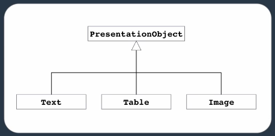
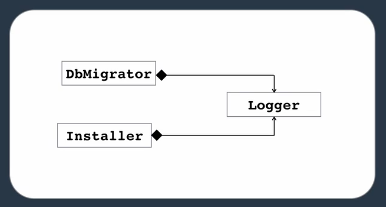
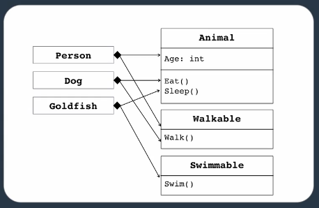
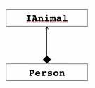
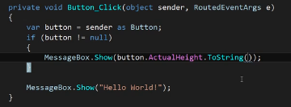
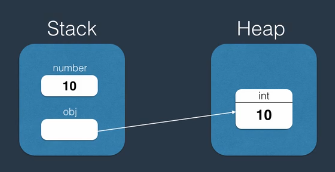
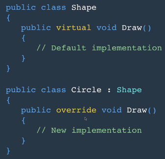

# Class Coupling

It is a measure of how interconnected classes and subsystems are.

## Tightly Coupled

An application were Classes are tightly connected with each other and a change in one class may result in a change in many others is called ***Tightly Coupled***. It is not a good practice to have tight coupled classes.

## Loose Coupled

Changes in one class are isolated and does not affect other classes.
This is called ***Loosely Coupled***.
We achieve a loose coupled application by understanding and using:

- Encapsulation
- Relations between classes
- Interfaces

We have 2 types of relationships in classes:

- Inheritance
- Composition
    Composition usually results in less coupling.

# Inheritance

Inheritance is a kind of relationship between two classes that allows one to inherit code from the other.
We refer to it as "is-a" relationship.
for example we say: a Car *is a* Vehicle.
It allows:

- Code re-use
- Polymorphic behavior



UML representation of inheritance in a PowerPoint-like application.

```c#
public class Parent{}
public class Child : Parent {}
```

***In C# a class can have only one Parent***

some methods such as:

- `Equals()`
- `GetHashCode()`
- `GetType()`
- `ToString()`
    Are defined in the `Object` class which is the parent of all classes in C#.
    So in new classes even if they are empty, we have these methods.

## Constructors in Inheritance

Base class constructors are always executed first.
Constructors do not get inherited.
When our base class' constructor has parameters that set its `private` fields, the child must feed the parent the needed parameters using `base()` like this:

```c#
    public class Vehicle
    {
        private string _name;

        public Vehicle(string name)
        {
            _name = name;
        }
    }

    public class Car : Vehicle
    {
        public Car(string name) : base(name)
        {
            
        }
    }

```

because the child class does not have access to the parents `private` fields. If those fields were `protected`, we don't need to do this and cant simply do it like this:

```c#
    public class Vehicle
    {
        protected string _name;

        public Vehicle(string name)
        {
            _name = name;
        }
    }

    public class Car : Vehicle
    {
        public Car(string name)
        {
            _name = name;
        }
    }

```

but for `private` fields we need to pass the argument to the parent.
We can use the `base()` method to choose which constructor of the parent class we want to use.

# Composition

It is a kind of relationship between two classes that allows one to contain the other.
We refer to it as "has-a" relationship.
For example we say: a Car *has a*n Engine.
It allows:

- Code re-use
- Flexibility
- A means to loose coupling



UML representation of Composition. In a case where we need a logger functionality.

```c#
public class Installer
{
    private Logger _logger;
    public Installer(Logger logger)
    {
        _logger = logger;
    }
}
```

## Favor Composition over Inheritance

Problems with inheritance is that amateur designers can easily abuse it. Which leads to larger hierarchies. That makes the application more fragile.



As you see, here, composition makes the code more loose coupled.
Another advantage of Composition is that, we can change a class into an ***Interface***. But in inheritance we cannot.



# Casting Objects

There are times when we need to convert objects to a base or a derived class reference.

- Upcasting: The conversion from a derived class to a base class. We can implicitly assign a derived object to a base class like this:
    
    ```
    Circle circle = new Circle();
    Shape shape = circle;
    ```
    
- Downcasting: The conversion from a base class to a derived class. We can cast a base class to a derived one with explicit conversion:
    `Circle anotherCircle = (Circle)shape;`
    

## as

If we try to cast an object to another object that is not derived or base, we get an `InvalidCastException`
To avoid this we use the `as` keyword.

```c#
// Instead of this
Car car = (Car)shape;

// We use this
Car car = shape as Car;
if(car == null){}
```

With the `as` keyword if the object cannot be converted to the target type, we do not get an exception. Instead we only get a `null` reference.

## is

With the `is` keyword we can check the type of an object.
`bool isCar = obj is Car;`

* * *

Downcasting creates another reference to an object. So in this example:

```c#
Circle circle = new Circle();
Shape shape = circle;
```

both `shape` and `circle` refer to the same object in memory. But basically the view is different in each of them. When using `circle` we have access to less methods(defined in the Circle class). This gives control.

Real world example of this in windows programming is this:



As we know all classes are derived from `object`.
`object sender` here is the source that was clicked. We know it was a button. So we downcast the sender object to a button, with the `as` keyboard, and if the conversion is successful we will display a message.

We can also upcast all reference types to `Object` type.

* * *

# Boxing & Unboxing

- Boxing is the process of converting a value type instance to an object reference. like this:
    
    ```c#
    int number = 10;
    object obj = number;
    // or
    object obj = 10;
    ```
    
    What happens here is that the value gets ***boxed*** by the ***CLR*** and is stored in the heap instead of the stack. Then an object is created in the stack that points to that value in heap.
    
    
    
- Unboxing: Converting a reference object to a value. We can do this with explicit conversion.
    
    ```c#
    object obj = 10;
    int number = (int)obj;
    ```
    

***Note***: Both Boxing and Unboxing have performance penalties. That's because of the object creation.

For example in an `ArrayList` where we can pass different types(primitive/non-primitive), the `Add()` method can take an `object` type. If we pass an integer there:

```c#
var list = newe ArrayList();
list.Add(1);
```

This means if we send a value type here, Boxing will happen. And when we get the value back and cast it, Unboxing happens. This affects performance.

# Method Overriding

It means modifying the implementation of an inherited method.
It is different from method overloading which means having a method with different signatures.

To override a method, we use the `virtual` and `override` keywords.
When we have a method in our base class that we want to override in its derived classes, we use the `virtual` keyword after the methods access modifiers. Then in the derived classes, on the inherited method we use `override` after the access modifier. This way we can override the method.

This helps with polymorphic behavior.



When using override, we have a `base.MethodName()` method we call in our method body. We can call this whenever we want to pass the control to the same method in the parent class.

***Note***: Upcasting an object to a base class does not prevent the overridden method in the derived class from being called if it is marked as virtual and overridden in the derived class. The runtime will determine which implementation of the method to call based on the actual type of the object.

# Abstract

This modifier indicates that a class or a member is missing implementation.
Sometimes we have abstract concepts in the project that don't make sense on their own, but find meaning in their derived classes.
Like a `Shape` class. A shape unless derived in classes like `Circle` Does not contain implementation. The `Draw()` method can't draw a shape because it does not have meaning.
So we use the `abstract` keyword on the method. an abstract method needs to be in an abstract class.
`abstract` methods are inherently `virtual` so to use them in derived classes we use `override`.
abstract classes also allow for polymorphic behavior.

***Abstract Members***

- Cannot include implementation:
    `public abstract void Draw();`
    
- If a member is declared as abstract, the containing class needs to be declared as abstract too.
    

***Derived Classes***

- Must implement all abstract members in the base abstract class.(`override`)

***Abstract Classes***

- Cannot be instantiated

We use abstract to provide some common behavior and force other developers to follow our design.
Not all members in an abstract class have to be abstract, but if even one of them is, our class needs to be abstract.

# Sealed

Prevents derivation of classes or overriding of methods.
This modifier can only be applied to methods that are overriding a virtual method on a base class.